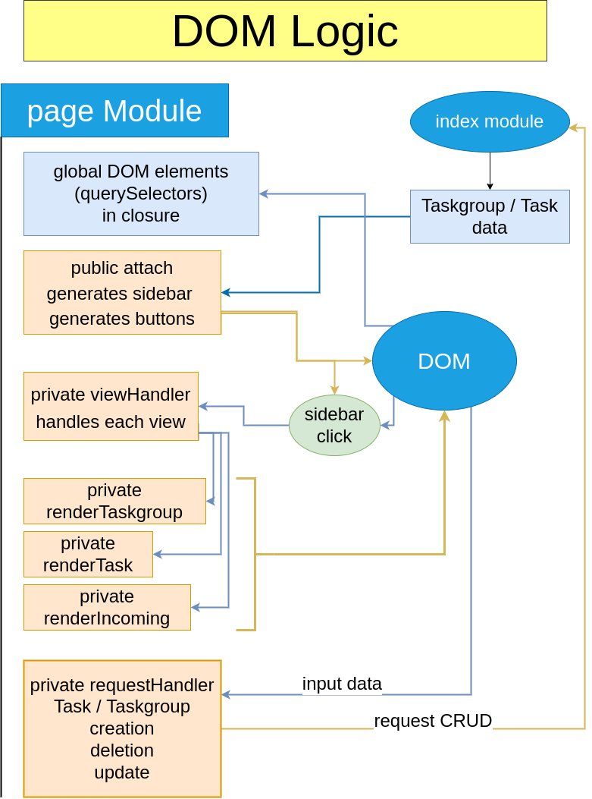

## Task Manager [project from TOP](https://www.theodinproject.com/lessons/node-path-javascript-todo-list)

### Planning stage 

1.  I started with a diagram of the structure I thought I would need for the application logic.
    as these things go, I would most likely have to change a lot of it as I go, but it always
    helps to build the skill.

    

2.  I set up Webpack with dev-server and all the assets and dist generation plugins. I also set up
    ESlint and Prettier.

3.  The DOM manipulation logic I did after the HTML template was done, so I had a better idea of
    what I needed to generate, and the view functions I had to code.

    

### Coding Stage

1. I coded all the application logic according to the diagram I initially made, with some minor changes. I was glad I didn't forget a lot of the logic when making the diagram, so my skills definitely improved since last time. I also wrote an API cheatsheet since I ended up making the module API a bit complicated (could maybe be improved with object composition?).

2. Started coding the HTML template and the DOM-generation module. While trying to access the object data from the DOMgen module I realised I needed to expand the Application module to make it parse the object data into a neutral object (so that the API of each module remained separate, otherwise DOMgen would need to use App API in order to use the data, and that's not SOLID).

3. I programmed the DOM-generation module to display the views, I had to work comparing dates for the first time and it was a nightmare, but I managed to make it work and to display everything correctly. After doing the views I started with the creation and deletion buttons, which would end up combining all modules together.