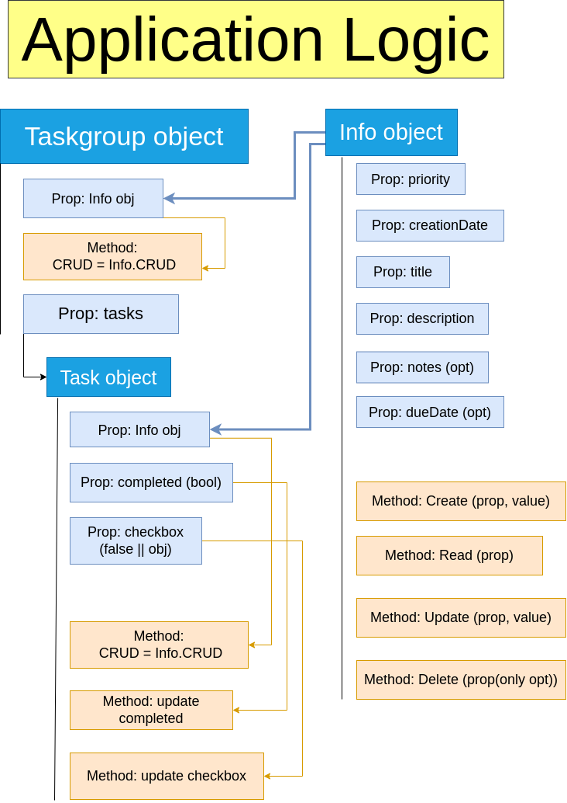

## Task Manager [project from TOP](https://www.theodinproject.com/lessons/node-path-javascript-todo-list)

#### Planning stage 

1.  I started with a diagram of the structure I thought I would need for the application logic.
    as these things go, I would most likely have to change a lot of it as I go, but it always
    helps to build the skill.

    